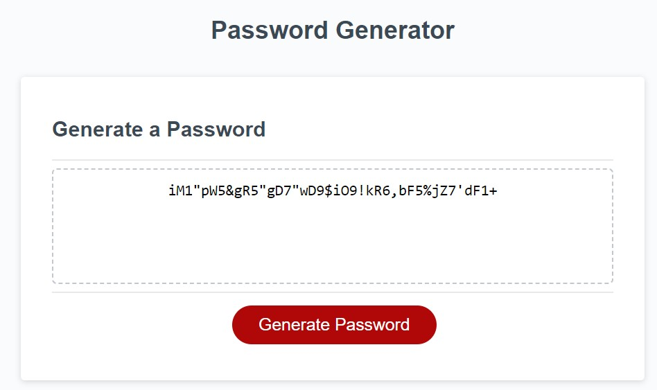

# Secure-Random-Password-Generator

## Description

A site that will help generate random, but secure, passwords based on certian criteria.
This will help provide greater security for my computer/company.

## Installation

Enter URL Here: https://natalieyaspo.github.io/Secure-Random-Password-Generator/

## Usage

User will be put through a series of prompts to generate a secure password.
These prompts ask if user would like to include certain criteria in their password including:
-length of password

-whether or not to include lowercase, uppercase, numeric and/or special characters

Then a random, secure password will be generated based on needed criteria.

## Credits

Starter Code from: https://git.bootcampcontent.com/UNC-Charlotte/UNCC-VIRT-FSF-FT-12-2023-U-LOLC

Code for array of lowercase alphabet: RayRay https://betterprogramming.pub/how-to-generate-an-alphabet-javascript-array-eae6940ea646

## License

None required.